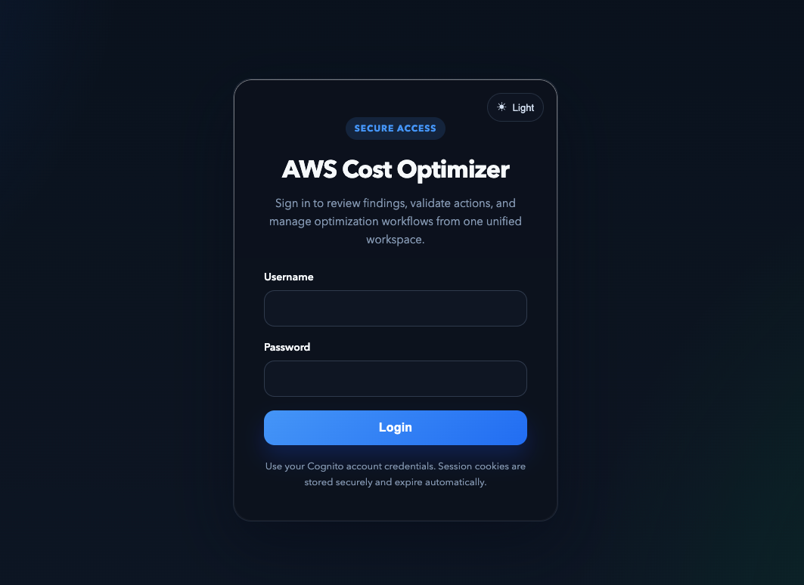
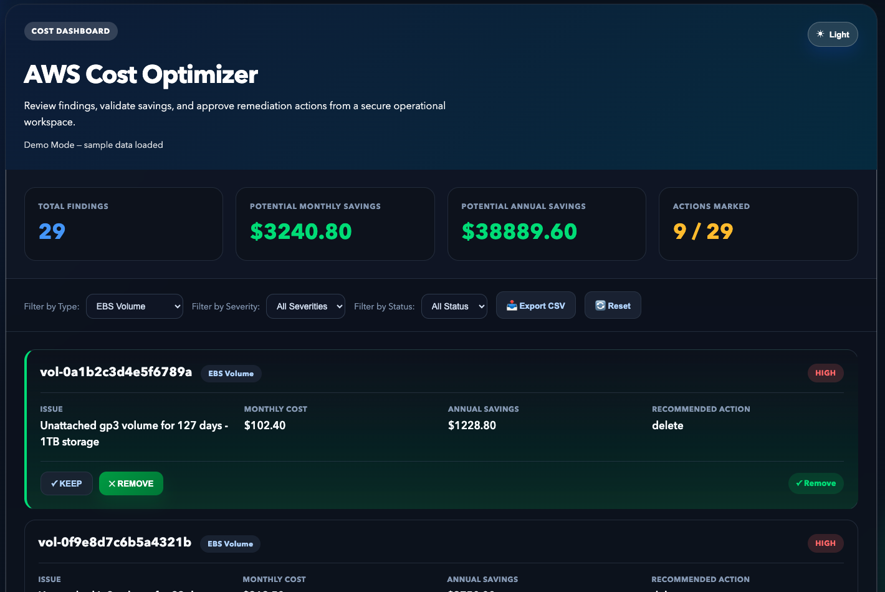

# AWS Cost Optimizer Framework

## Production-Ready Infrastructure for Multi-Account AWS Cost Optimization

A **CloudFormation-deployed, automated AWS cost optimization system** for teams that need cross-account visibility, governed decision workflows, and safe automated execution — without building it from scratch.

**Best suited for:** Organizations with 5+ AWS accounts · $10K+/month AWS spend · Enterprises requiring audit trails · FinOps and DevOps teams · MSPs managing customer AWS accounts

✅ Runs automatically — daily analysis, no manual commands  
✅ Analyzes EBS, EC2, and S3 across 100+ accounts  
✅ Approval workflow — Keep, Remove, Notify, Schedule, Rightsize, Lifecycle  
✅ Tag-based protection prevents accidental deletions  
✅ Full audit trail for compliance  

---

## Real Problems It Solves

| Problem | Detection | Typical Monthly Savings |
|---------|-----------|------------------------|
| Unattached EBS volumes | Volume state scan | $2K–5K |
| Idle EC2 instances | CloudWatch CPU < 5% for 7 days | $3K–10K |
| S3 waste — multipart, cold data, missing lifecycle | Bucket audits | $500–2K + lifecycle gains |
| EC2 off-hours waste (non-production) | Tag-based schedule policies | $5K–20K |
| No cross-account visibility | Consolidated dashboard with estimated savings | Data-driven decisions |

---

## Architecture

```
┌───────────────────────────────────────────────────────────┐
│  AWS CloudFormation Stack (deploy once)                   │
│                                                           │
│  EventBridge Cron ─────────────────────────────────────┐ │
│         │                                               │ │
│  Analysis Lambda                Scheduler Lambda        │ │
│  • EBS, EC2, S3 scans           • EC2/EMR start-stop    │ │
│  • Metrics context              • S3 lifecycle flows    │ │
│  • JSON findings → S3           • Dry-run / execute     │ │
└─────────┼───────────────────────────────────────────────┘ │
          │
    CloudFront (HTTPS · Lambda@Edge auth)
          │
    Web Dashboard  (login required · filters · export CSV)
```

**Everything deployed automatically:** Lambda, EventBridge, S3, CloudFront, Cognito, API Gateway, IAM, CloudWatch alarms, SNS, GitHub Actions CI/CD.

```bash
./deploy.sh --stack-name cost-optimizer \
  --config-bucket my-config --report-bucket my-reports \
  --decisions-bucket my-decisions --dashboard-bucket my-dashboard-12345 \
  --cross-account-external-id cost-optimizer-ext-123 \
  --admin-email admin@company.com --email ops@company.com
```

**Daily flow:**
```
2 AM UTC   → Analysis Lambda scans accounts and publishes findings
Any time   → Users review findings and approve actions in dashboard
6 AM/6 PM  → Scheduler Lambda executes approved actions with safety checks
```

---

## Safety & Compliance

Five protection layers ensure no unintended resource changes:

| Layer | Mechanism |
|-------|-----------|
| 1. Authentication | Cognito login + CloudFront + Lambda@Edge on every request |
| 2. User Decision | Explicit action required — Keep / Remove / Notify / Schedule / Lifecycle |
| 3. Tag Protection | `Environment=prod`, `DoNotDelete=true`, `ProtectFromCostOptimizer=true` block execution |
| 4. Audit Logging | Every action logged to CloudWatch Logs — timestamp, resource, action, status |
| 5. Human Review | SNS summary email after each scheduler run |

No resource is modified without explicit user approval **and** passing all safety checks.

---

## Multi-Account Support

Deploy a central stack in one account. Use the included cross-account CloudFormation template to provision a least-privilege role in each target account. The dashboard shows findings from all accounts with regional breakdown.

```yaml
accounts:
  - id: "111111111111"
    name: "production"
    role_arn: "arn:aws:iam::111111111111:role/CostOptimizerRole"
  - id: "222222222222"
    name: "staging"
    role_arn: "arn:aws:iam::222222222222:role/CostOptimizerRole"
```

---

## Demo Dashboard

Experience the optimizer with realistic synthetic data before deploying to production.





```bash
cd dashboard/demo && python3 -m http.server 8000
# Open http://localhost:8000/demo.html
```

28 realistic findings across EBS, EC2, and S3 — interactive approvals, real-cost calculations, filtering, and CSV export.

---

## AWS Native vs This Framework

AWS provides strong recommendation services. Turning those into a governed, repeatable, cross-account operating process still requires significant engineering effort.

| Capability | AWS Native | This Framework |
|------------|------------|----------------|
| Recommendation visibility | Strong, service-specific | Consolidated findings and estimated savings |
| Decision governance | Needs custom build per team | Built-in approval workflow (Keep/Remove/Notify/Schedule/Lifecycle) |
| Cross-account consistency | Requires engineering design | Standardized triage and execution flow |
| Safety controls before action | Available, effort varies | Built-in guardrails and policy-aware execution |
| Audit trail | Requires service integration | Decision and action tracking included |

**Positioning:** AWS tells you what might be optimized. This framework gives teams the governed operating layer to safely decide and act on it — without each team building it separately.

Runtime cost (Lambda, EventBridge, S3, CloudWatch, API Gateway, Cognito, SNS) is typically low relative to avoided waste. This framework complements AWS native tools — it does not replace them.

---

## FAQs

### If AWS already has cost tools, why use this?
AWS recommendations are distributed across services and typically stop at insight. This framework adds the operating layer to safely act on them: consolidated workflow, approval options, safety guardrails, audit trail, and stakeholder notifications — without rebuilding that from scratch per team.

### Is this replacing native AWS services?
No. AWS provides telemetry and recommendations. This framework adds custom scoring logic and standardizes triage, governance, and action execution across accounts and teams.

### Why not auto-delete everything with high savings?
Optimization without context causes outages, deployment failures, and IaC drift. This framework is intentionally designed for safe, reviewable optimization over blind automation.

---

## 🤖 AI Assistance

AI assistants (Claude & GitHub Copilot Chat) were used as a **productivity aid** for parts of the implementation.  
The end-to-end architecture, design integrity, and cost optimization framework reflect hands-on experience building and optimizing AWS environments at scale.

---

## License

MIT — Use freely in your organization
